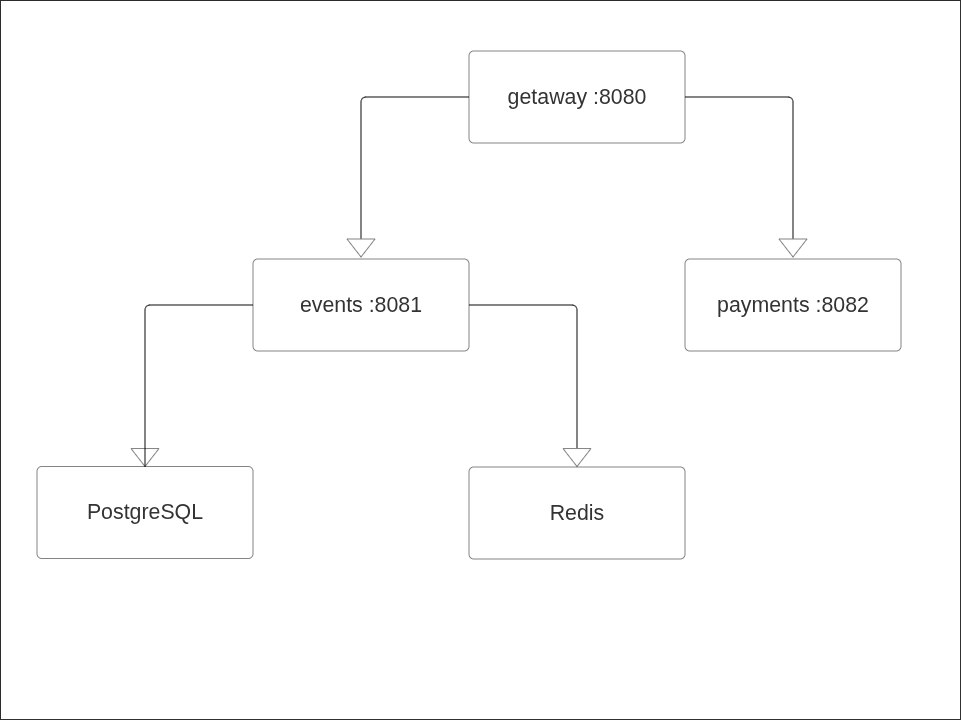

# Lab 1 — SRE Philosophy: Deploy, Break, Understand

## Task 1 — Deploy & Break QuickTicket

### 1.1 Deployment

QuickTicket was deployed with Docker Compose:

```bash
docker compose up --build -d
```

All five required services were running:

```text
NAME              IMAGE                COMMAND                  SERVICE    STATUS                    PORTS
app-events-1      app-events           "uvicorn main:app --…"   events     Up                        0.0.0.0:8081->8081/tcp, [::]:8081->8081/tcp
app-gateway-1     app-gateway          "uvicorn main:app --…"   gateway    Up                        0.0.0.0:3080->8080/tcp, [::]:3080->8080/tcp
app-payments-1    app-payments         "uvicorn main:app --…"   payments   Up                        0.0.0.0:8082->8082/tcp, [::]:8082->8082/tcp
app-postgres-1    postgres:17-alpine   "docker-entrypoint.s…"   postgres   Up (healthy)              0.0.0.0:5432->5432/tcp, [::]:5432->5432/tcp
app-redis-1       redis:7-alpine       "docker-entrypoint.s…"   redis      Up (healthy)              0.0.0.0:6379->6379/tcp, [::]:6379->6379/tcp
```

### 1.2 Critical Path Verification

The full application flow was tested through the API Gateway.

#### List events

```bash
curl -s http://localhost:3080/events | python3 -m json.tool
```

```json
[
    {
        "id": 1,
        "name": "Go Conference 2026",
        "venue": "Main Hall A",
        "date": "2026-09-15T09:00:00+00:00",
        "total_tickets": 100,
        "price_cents": 5000,
        "available": 100
    },
    {
        "id": 4,
        "name": "Python Workshop",
        "venue": "Lab 301",
        "date": "2026-09-22T14:00:00+00:00",
        "total_tickets": 25,
        "price_cents": 2000,
        "available": 25
    },
    {
        "id": 2,
        "name": "SRE Meetup",
        "venue": "Room 204",
        "date": "2026-10-01T18:00:00+00:00",
        "total_tickets": 30,
        "price_cents": 0,
        "available": 30
    },
    {
        "id": 5,
        "name": "Kubernetes Deep Dive",
        "venue": "Auditorium B",
        "date": "2026-10-10T10:00:00+00:00",
        "total_tickets": 80,
        "price_cents": 8000,
        "available": 80
    },
    {
        "id": 3,
        "name": "Cloud Native Summit",
        "venue": "Expo Center",
        "date": "2026-11-20T10:00:00+00:00",
        "total_tickets": 500,
        "price_cents": 15000,
        "available": 500
    }
]
```

#### Reserve a ticket

```bash
curl -s -X POST http://localhost:3080/events/1/reserve \
  -H "Content-Type: application/json" \
  -d '{"quantity": 1}' | python3 -m json.tool
```

```json
{
    "reservation_id": "cc2b6bcb-1ace-4f09-a65d-a72f5febe36e",
    "event_id": 1,
    "quantity": 1,
    "total_cents": 5000,
    "expires_in_seconds": 300
}
```

#### Pay for the reservation

```bash
curl -s -X POST \
  http://localhost:3080/reserve/cc2b6bcb-1ace-4f09-a65d-a72f5febe36e/pay \
  | python3 -m json.tool
```

```json
{
    "order_id": "cc2b6bcb-1ace-4f09-a65d-a72f5febe36e",
    "event_id": 1,
    "quantity": 1,
    "total_cents": 5000,
    "status": "confirmed"
}
```

#### Health check

```bash
curl -s http://localhost:3080/health | python3 -m json.tool
```

```json
{
    "status": "healthy",
    "checks": {
        "events": "ok",
        "payments": "ok",
        "circuit_payments": "CLOSED"
    }
}
```

### 1.3 Architecture

The Gateway is the external entry point. It forwards event and reservation requests to the Events service and payment requests to the Payments service. Events uses PostgreSQL for persistent event/order data and Redis for temporary reservations and held-ticket state.

The service interaction map is shown below:



The main dependency chains are `gateway → events → PostgreSQL`, `gateway → events → Redis`, and `gateway → payments`.

### 1.4 Systematic Failure Exploration

Each component was stopped independently and the application behavior was observed.

#### Payments failure

```bash
docker compose stop payments
```

Events listing continued to work and reservations could still be created:

```json
{
    "reservation_id": "bec21fda-29e1-40d6-9375-5121cc1aacd6",
    "event_id": 1,
    "quantity": 1,
    "total_cents": 5000,
    "expires_in_seconds": 300
}
```

Before the graceful-degradation change, payment attempts returned the generic error:

```json
{
    "detail": "Payment service unavailable"
}
```

The health endpoint correctly detected the failure:

```json
{
    "status": "degraded",
    "checks": {
        "events": "ok",
        "payments": "down",
        "circuit_payments": "CLOSED"
    }
}
```

**Observation:** Payments is not required for browsing or creating a reservation. The blast radius is mainly the payment path. The Gateway health endpoint reports the system as degraded while Events remains available.

```bash
docker compose start payments
```

#### Events failure

```bash
docker compose stop events
```

Event listing failed:

```json
{
    "detail": "Events service unavailable"
}
```

Reservation also failed:

```json
{
    "detail": "Events service unavailable"
}
```

Health check:

```json
{
    "status": "degraded",
    "checks": {
        "events": "down",
        "payments": "ok",
        "circuit_payments": "CLOSED"
    }
}
```

**Observation:** Events is on the critical path for listing and reserving tickets. Payment confirmation also depends on Events, so a payment can reach Payments but the order cannot be confirmed while Events is unavailable.

```bash
docker compose start events
```

#### Redis failure

```bash
docker compose stop redis
```

Listing events still worked because event data is stored in PostgreSQL. A reservation attempt failed with a timeout:

```json
{
    "detail": "Events service timeout"
}
```

Health check:

```json
{
    "status": "degraded",
    "checks": {
        "events": "down",
        "payments": "ok",
        "circuit_payments": "CLOSED"
    }
}
```

**Observation:** The event catalog remains readable without Redis, but reservation state depends on Redis. Reservation and later confirmation therefore fail or time out when Redis is unavailable.

```bash
docker compose start redis
```

#### PostgreSQL failure

```bash
docker compose stop postgres
```

Event listing failed:

```json
{
    "detail": "Events service unavailable"
}
```

Reservation returned an internal server error:

```text
Internal Server Error
```

Health check:

```json
{
    "status": "degraded",
    "checks": {
        "events": "degraded",
        "payments": "ok",
        "circuit_payments": "CLOSED"
    }
}
```

**Observation:** PostgreSQL is required for the event catalog and order persistence. Its failure breaks event listing, reservation creation, and order confirmation, while the standalone Payments service remains reachable.

```bash
docker compose start postgres
```

#### Failure summary

| Component Killed | Events List | Reserve | Pay | Health Check | User Impact |
|---|---|---|---|---|---|
| payments | Works | Works | Fails; payment service unavailable | `degraded`, payments `down` | Users can browse and reserve, but cannot pay |
| events | Fails | Fails | Fails during confirmation | `degraded`, events `down` | Ticket workflow is unavailable |
| redis | Works | Fails / times out | Fails because reservation state cannot be read | `degraded`, events reported `down` | Catalog is readable, but reservations cannot be reliably held/confirmed |
| postgres | Fails | Fails | Fails during order confirmation | `degraded`, events `degraded` | Event and order operations are unavailable |

### 1.5 Load Generator

With all services running:

```bash
./app/loadgen/run.sh 5 30
```

```text
QuickTicket Load Generator
Target: http://localhost:3080 | RPS: 5 | Duration: 30s
---
[10s] requests=42 success=42 fail=0 error_rate=0%
[10s] requests=43 success=43 fail=0 error_rate=0%
[10s] requests=44 success=44 fail=0 error_rate=0%
[10s] requests=45 success=45 fail=0 error_rate=0%
[20s] requests=83 success=83 fail=0 error_rate=0%
[20s] requests=84 success=84 fail=0 error_rate=0%
[20s] requests=85 success=85 fail=0 error_rate=0%
[20s] requests=86 success=86 fail=0 error_rate=0%
---
Done. total=124 success=124 fail=0 error_rate=0%
```

When Payments was unavailable during the load test, failures appeared and the error rate increased:

```text
QuickTicket Load Generator
Target: http://localhost:3080 | RPS: 5 | Duration: 30s
---
[10s] requests=37 success=36 fail=1 error_rate=2.7%
[10s] requests=38 success=37 fail=1 error_rate=2.6%
[10s] requests=39 success=38 fail=1 error_rate=2.5%
[10s] requests=40 success=39 fail=1 error_rate=2.5%
[20s] requests=74 success=68 fail=6 error_rate=8.1%
[20s] requests=75 success=69 fail=6 error_rate=8.0%
[20s] requests=76 success=69 fail=7 error_rate=9.2%
[20s] requests=77 success=70 fail=7 error_rate=9.0%
[20s] requests=78 success=71 fail=7 error_rate=8.9%
---
Done. total=97 success=84 fail=13 error_rate=13.4%
```

**Observation:** The healthy baseline completed with a 0% error rate. With Payments unavailable, the final error rate reached 13.4%. Other request types continued to succeed, showing that the Payments failure has a limited but visible blast radius rather than making the entire system unavailable.

---

## Task 2 — Graceful Degradation

The Gateway was changed so that connection failures to Payments return a clear HTTP 503 response instead of a generic 502. Event listing and reservation creation are unaffected because they do not require Payments.

### Gateway change

```diff
--- a/app/gateway/main.py
+++ b/app/gateway/main.py
@@
     except httpx.TimeoutException:
         raise HTTPException(504, "Payment service timeout")
     except httpx.HTTPStatusError as e:
         raise HTTPException(e.response.status_code, "Payment failed")
+    except httpx.ConnectError:
+        return JSONResponse(
+            status_code=503,
+            content={
+                "error": "payments_unavailable",
+                "message": "Payment service is temporarily down. Try again in a few minutes",
+                "reservation_id": reservation_id,
+            },
+        )
     except Exception as e:
         log.error(f"payment error: {e}")
         raise HTTPException(502, "Payment service unavailable")
```

### Reservation while Payments is down

```json
{
    "reservation_id": "08761712-e4dd-4a42-af44-a3f10c342c9f",
    "event_id": 1,
    "quantity": 1,
    "total_cents": 5000,
    "expires_in_seconds": 300
}
```

### Payment while Payments is down

```text
HTTP/1.1 503 Service Unavailable
content-type: application/json
```

```json
{
    "error": "payments_unavailable",
    "message": "Payment service is temporarily down. Try again in a few minutes",
    "reservation_id": "08761712-e4dd-4a42-af44-a3f10c342c9f"
}
```

**Observation:** A Payments outage no longer produces an ambiguous gateway error. The reservation remains created while the user receives an explicit `503 Service Unavailable` response telling them that payment can be retried later.

---

## Task 3 — GitHub Community Engagement

The required repositories were starred, and the professor, TAs, and at least three classmates were followed on GitHub.

Starring repositories is useful for bookmarking projects and also gives maintainers a visible signal of community interest. Following developers helps discover their work and stay aware of activity from teammates, classmates, and other engineers working on related projects.

---

## Bonus Task — Resource Usage Under Load

Only QuickTicket containers are included in the comparison below; unrelated containers running on the host were excluded.

### B.1 Baseline — idle

```bash
docker stats --no-stream --format "table {{.Name}}\t{{.CPUPerc}}\t{{.MemUsage}}\t{{.NetIO}}\t{{.PIDs}}"
```

| Container | CPU | Memory | Net I/O | PIDs |
|---|---:|---:|---:|---:|
| app-gateway-1 | 0.20% | 37.05 MiB | 18 kB / 2.33 kB | 2 |
| app-events-1 | 0.17% | 39.21 MiB | 21.1 kB / 5.39 kB | 2 |
| app-postgres-1 | 5.55% | 13.38 MiB | 20.1 kB / 2.92 kB | 8 |
| app-redis-1 | 1.18% | 9.234 MiB | 19.4 kB / 1.46 kB | 6 |
| app-payments-1 | 0.23% | 32.21 MiB | 1.17 kB / 126 B | 1 |

The PostgreSQL CPU value is an instantaneous sample and can include background database work even while the application is otherwise idle.

### B.2 Under load

The load generator was run at 10 RPS:

```bash
./app/loadgen/run.sh 10 30
```

```text
QuickTicket Load Generator
Target: http://localhost:3080 | RPS: 10 | Duration: 30s
---
[10s] requests=63 success=63 fail=0 error_rate=0%
...
[20s] requests=142 success=142 fail=0 error_rate=0%
---
Done. total=206 success=206 fail=0 error_rate=0%
```

A representative `docker stats` snapshot during load:

| Container | CPU | Memory | Net I/O | PIDs |
|---|---:|---:|---:|---:|
| app-gateway-1 | 12.02% | 39.04 MiB | 116 kB / 99.4 kB | 2 |
| app-events-1 | 5.82% | 40.05 MiB | 107 kB / 119 kB | 2 |
| app-postgres-1 | 1.48% | 13.76 MiB | 67.9 kB / 53.7 kB | 8 |
| app-redis-1 | 7.06% | 9.109 MiB | 36.7 kB / 8.45 kB | 6 |
| app-payments-1 | 1.77% | 33.63 MiB | 8.37 kB / 4.47 kB | 2 |

### B.3 Fault injection

Payments was restarted with a 30% injected failure rate and 500 ms latency:

```bash
docker compose stop payments
PAYMENT_FAILURE_RATE=0.3 PAYMENT_LATENCY_MS=500 docker compose up -d payments
```

A representative resource snapshot with fault injection enabled:

| Container | CPU | Memory | Net I/O | PIDs |
|---|---:|---:|---:|---:|
| app-payments-1 | 0.78% | 20.00 MiB | 4.18 kB / 1.61 kB | 2 |
| app-gateway-1 | 5.30% | 39.87 MiB | 391 kB / 361 kB | 2 |
| app-events-1 | 1.90% | 40.81 MiB | 341 kB / 433 kB | 2 |
| app-postgres-1 | 0.38% | 13.98 MiB | 200 kB / 204 kB | 8 |
| app-redis-1 | 0.66% | 6.488 MiB | 74.2 kB / 21.9 kB | 6 |

Normal Payments configuration was restored afterwards:

```bash
docker compose stop payments
PAYMENT_FAILURE_RATE=0.0 PAYMENT_LATENCY_MS=0 docker compose up -d payments
```

### Resource comparison

| Scenario | Most CPU-intensive QuickTicket service | Most memory-intensive QuickTicket service | Observation |
|---|---|---|---|
| Idle | PostgreSQL in the captured instant (5.55%) | Events (~39.21 MiB) | Very little application traffic; CPU samples can reflect background work |
| Load | Gateway (12.02%) | Events (~40.05 MiB) | Gateway handles every incoming request; Events handles most ticket operations |
| Fault injection | Gateway (5.30% in representative snapshot) | Events (~40.81 MiB) | Slow/failing Payments keeps Gateway requests in flight longer |

### Analysis

Memory usage remained relatively stable across the tests. Events used the most memory among the QuickTicket application containers, at roughly 39–41 MiB. Under normal load, Gateway showed the clearest CPU increase, from about 0.2% in the idle sample to approximately 5–12% in repeated load samples, because all client traffic passes through it. Events also increased to roughly 3–6% CPU because most generated traffic uses event and reservation endpoints.

Network I/O increased strongly during load, confirming that the higher CPU values corresponded to real request traffic. With 500 ms payment latency injected, the Gateway had to keep payment requests open for longer. This increases the amount of concurrent in-flight work even when CPU does not necessarily exceed the normal-load peak, because much of the additional time is spent waiting on network I/O.
